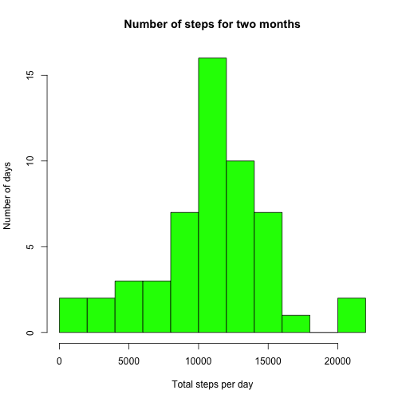
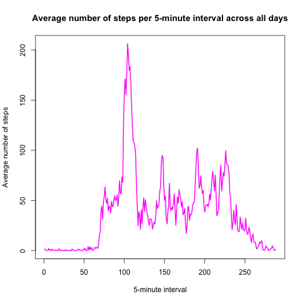
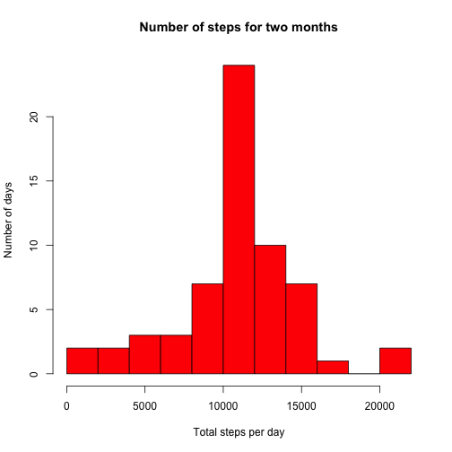
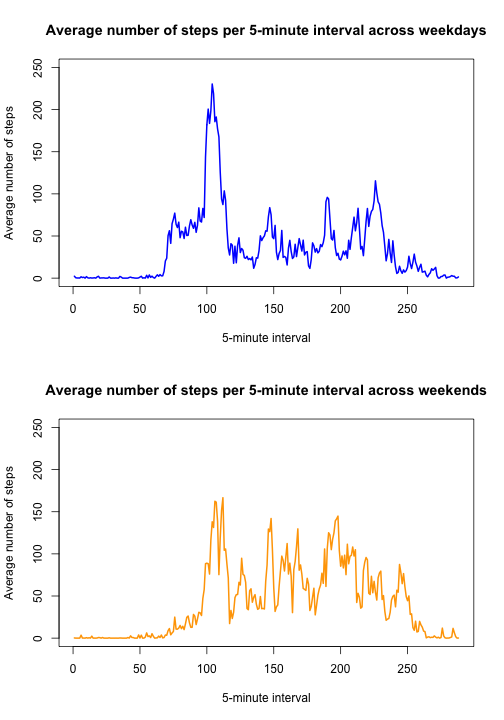

#Reproducible Research Programming Project 1
by Zeid M. Rusan  
&nbsp;

###Just in case, to be explicit, we set echo = TRUE globally

```r
knitr::opts_chunk$set(echo = TRUE)
```
&nbsp;

###Loading and preprocessing the data
First, we read in the data, check it out with str, and format the dates with as.Date.

```r
activity_data <- read.csv("activity.csv")
str(activity_data)
```

```
## 'data.frame':	17568 obs. of  3 variables:
##  $ steps   : int  NA NA NA NA NA NA NA NA NA NA ...
##  $ date    : Factor w/ 61 levels "2012-10-01","2012-10-02",..: 1 1 1 1 1 1 1 1 1 1 ...
##  $ interval: int  0 5 10 15 20 25 30 35 40 45 ...
```

```r
activity_data$date <- as.Date(activity_data$date)
```
&nbsp;

###What is the mean total number of steps taken per day?
Will use aggregate to sum step over each day (in list).  
Then, we will plot these data across time with a histogram.  
Finally, we will report the mean and median of the step sums per days across all days.

```r
sumOfsteps <- aggregate(activity_data$steps, by=list(activity_data$date), FUN=sum)
hist(sumOfsteps$x,col = "green",xlab = "Total steps per day",ylab = "Number of days",breaks = 8,main = "Number of steps for two months")
```



```r
meanOfStep <- mean(sumOfsteps$x,na.rm = T)
medianOfStep <- median(sumOfsteps$x,na.rm = T)
```
The **mean** of the total number of steps per day for 2 months was **1.0766189 &times; 10<sup>4</sup>**

The **median** of the total number of steps per day for 2 months was **10765**  
&nbsp;  


###What is the average daily activity pattern?
We need to average all of the steps per interval, across all days.  
This calls for a similar call to aggregate function as done above (remove NAs for call to mean, of course).  
Next, we plot these data.  
Finally, we deduce the maximum steps, find the interval "id" and then report its row (the rank of the interval).  
**NOTE: x-axis is rank of 5-minute interval instead of actual "minutes". Personal preferance.**

```r
meanOfsteps <- aggregate(activity_data$steps, by=list(activity_data$interval), FUN=mean,na.rm=T)
plot(1:nrow(meanOfsteps),meanOfsteps$x,type="l",col="magenta",lwd=2,xlab="5-minute interval",ylab="Average number of steps",main="Average number of steps per 5-minute interval across all days")
```



```r
intervalID <- meanOfsteps$Group.1[which(meanOfsteps$x==max(meanOfsteps$x))]
rankOfinterval <- match(intervalID,meanOfsteps$Group.1)
```
The 5-minute interval (rank) with the most steps on average was the **104th** 5-minute interval of the day, which corresponds to the **835** 5-minute interval.  
&nbsp;  
  
  
###Imputting missing values
We first need to report the total number of missing values in the data.

```r
missingValueTotal <- sum(is.na(activity_data$steps))
```
The total number of missing values in the dataset is **2304**  
&nbsp;  

Next, we want to replace missing values in a clone of the dataset with the corresponding mean of that 5-minute interval across all days calculated previously.
Then, plot the histogram of this dataset with no NAs.

```r
fixed_activity_data <- activity_data
  for(i in 1:nrow(meanOfsteps)){
    currentInterval <- meanOfsteps[i,1]
    currentMean <- meanOfsteps[i,2]
    subsettingLogicals <- which(activity_data$interval==currentInterval)
    fixed_activity_data[subsettingLogicals,][is.na(fixed_activity_data[subsettingLogicals,])] <- currentMean
  }
NEWsumOfsteps <- aggregate(fixed_activity_data$steps, by=list(fixed_activity_data$date), FUN=sum)
hist(NEWsumOfsteps$x,col = "red",xlab = "Total steps per day",ylab = "Number of days",breaks = 8,main = "Number of steps for two months")
```



```r
NEWmeanOfStep <- mean(NEWsumOfsteps$x)
NEWmedianOfStep <- median(NEWsumOfsteps$x)
```
The **mean** of the total number of steps per day for 2 months *after imputing data* was **1.0766189 &times; 10<sup>4</sup>**

The **median** of the total number of steps per day for 2 months *after imputing data* was **1.0766189 &times; 10<sup>4</sup>**  

**Thus, it appears that imputing the relatively few missing values did not heavily impact the estimates of total daily number of steps**.  
&nbsp; 

###Are there differences in activity patterns between weekdays and weekends?
Here we want to make use of the dplyr package to create the new factor variable. Thus, we mutate the dataset that has no NAs and add a variable based on whether the date corresponds to a weekday or weekend.  
Finally, we want to plot the data, split on the factor "DayType", that corresponds to a weekday or a weekend day.  
**NOTE: x-axis is rank of 5-minute interval instead of actual "minutes". Personal preferance.**

```r
  library(dplyr)
```

```
## 
## Attaching package: 'dplyr'
```

```
## The following objects are masked from 'package:stats':
## 
##     filter, lag
```

```
## The following objects are masked from 'package:base':
## 
##     intersect, setdiff, setequal, union
```

```r
  fixed_activity_data <- mutate(fixed_activity_data,DayType = factor(1 * (weekdays(fixed_activity_data$date)=="Saturday"|weekdays(fixed_activity_data$date)=="Sunday"),labels = c("Weekday","Weekend")))
  splitData <- split(fixed_activity_data,fixed_activity_data$DayType)
  meanWeekdaySteps <- aggregate(splitData[[1]]$steps, by=list(splitData[[1]]$interval), FUN=mean)
  meanWeekendSteps <- aggregate(splitData[[2]]$steps, by=list(splitData[[2]]$interval), FUN=mean)
par(mfrow=c(2,1))
plot(1:nrow(meanWeekdaySteps),meanWeekdaySteps$x,type="l",col="blue",lwd=2,xlab="5-minute interval",ylab="Average number of steps",main="Average number of steps per 5-minute interval across weekdays",ylim=c(0,250))
plot(1:nrow(meanWeekendSteps),meanWeekendSteps$x,type="l",col="orange",lwd=2,xlab="5-minute interval",ylab="Average number of steps",main="Average number of steps per 5-minute interval across weekends",ylim=c(0,250))
```



